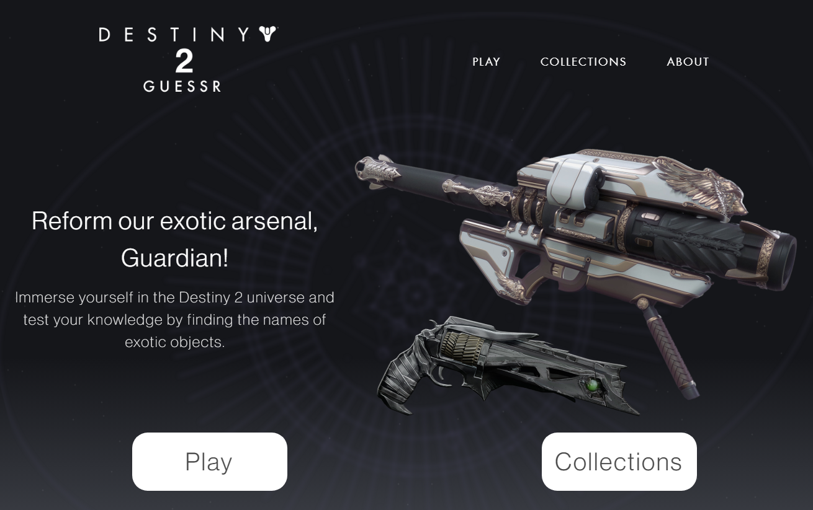
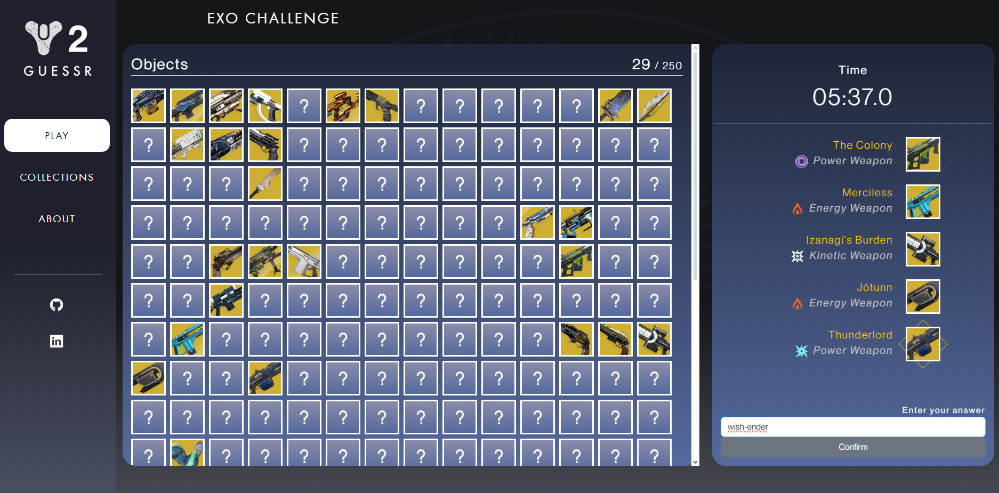
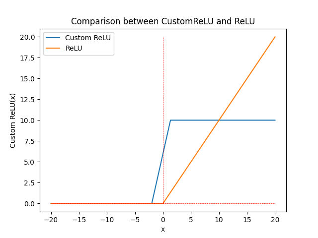
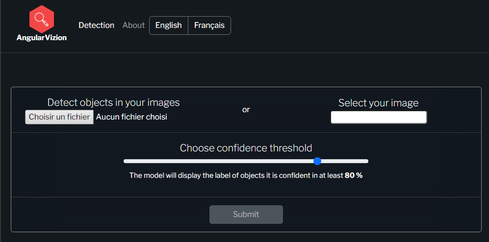

# Hello, I'm Yoann MONTEIRO 👋

##  About Me

I'm a passionate **Junior Back-End Dev** who loves software engineering. My interests range from backend web development to data science.

## Currently Working On

- **[Destiny 2 Guessr](https://github.com/Yoannmont/Destiny-2-guessr)**: A web application dedicated to the universe and equipment of the Destiny 2 game, developed by Bungie. This project combines my passion for gaming with my skills in web development and data analysis.  
You can check it on [d2guessr.netlify.app](https://d2guessr.netlify.app).  

  

- **Secret Projects**: ?????

I'm constantly learning and seeking new challenges. Here are a few things I'm currently focusing on:

- Full-Stack Web Development
- Advanced Machine Learning Techniques
- Cloud Computing and Big Data Technologies

## 🌟 Completed Projects

### 1. [Randomized ReLU](https://github.com/Yoannmont/Randomized-ReLU)

 
A study of the impact of a Randomized ReLU function on the performance of a neural network model.

### 2. [AngularVision](https://github.com/Yoannmont/AngularVizion)

 
A web application for object detection on images with Angular, PyTorch and Flask.

## 📫 How to reach me

- **Email**: y.mont@orange.fr
- **LinkedIn**: [Yoann MONTEIRO](https://www.linkedin.com/in/yoann-monteiro-471321210/)

Feel free to explore my repositories and connect with me on my social platforms!
